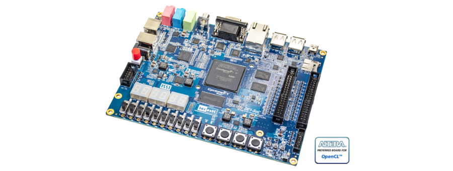

 

# Working with FPGA and VHDL

This repository contains my hands-on work and practical sessions (TPs) with FPGA and VHDL. As part of my learning process, I am documenting each practical session, using the `ALTERA Cyclone V SoC DE-1 SoC` board.

These sessions include practical exercises and implementations for various tasks such as hardware design and VHDL coding for FPGA. The repository will be continuously updated as I progress with more sessions.

## Related Resources

- **FPGA Programming for Beginners**: Learn FPGA concepts through a structured study of the "FPGA Programming for Beginners" book by Frank Bruno. [Link to the repo](https://github.com/Choaib-ELMADI/fpga-programming-for-beginners)
- **Getting Started with VHDL**: Explore the fundamentals of VHDL programming with practical exercises and projects. [Link to the repo](https://github.com/Choaib-ELMADI/getting-started-with-vhdl)

## Goals

- Gain hands-on experience with FPGA design and VHDL.
- Document each practical session and share insights.
- Create resources for learning FPGA and VHDL for others.

## How to Use This Repository

- **Browse the sessions**: Explore each practical session folder to view my implementations.
- **VHDL Code**: Check out the VHDL files and simulation setups for the FPGA designs.
- **Exercises**: Solutions for exercises are included for learning purposes.

## Practical Sessions (TPs)

### [TP 1 - Introduction to Quartus and FPGA Design](./TP1/)

Feel free to explore and contribute if you have any suggestions or improvements.
